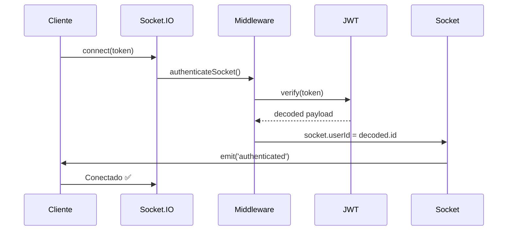

# 🔌 WebSockets - Notificaciones en Tiempo Real

## 📋 Descripción

Sistema de notificaciones en tiempo real implementado con **Socket.IO** que permite enviar actualizaciones instantáneas a los clientes sin necesidad de polling o recargar la página.

---

## ✨ Características

- ✅ **Autenticación JWT**: Conexión segura mediante token
- ✅ **Rooms por usuario**: Cada usuario tiene su canal privado (`user:{id}`)
- ✅ **Eventos tipados**: TypeScript para seguridad de tipos
- ✅ **Reconexión automática**: Socket.IO maneja reconexiones
- ✅ **Transport fallback**: WebSocket + polling
- ✅ **CORS configurado**: Seguridad para frontend
- ✅ **Logging completo**: Trazabilidad de conexiones

---

## 🏗️ Arquitectura

```
┌─────────────┐         ┌──────────────┐         ┌──────────────┐
│   Frontend  │ ◄──────►│  Socket.IO   │ ◄──────►│   Backend    │
│   Cliente   │  WSS    │    Server    │         │   Service    │
└─────────────┘         └──────────────┘         └──────────────┘
                               │
                               ▼
                    ┌────────────────────┐
                    │  Rooms por Usuario │
                    │   user:1, user:2   │
                    └────────────────────┘
```

### Flujo de Datos

1. **Cliente se conecta** → Socket.IO Server
2. **Autenticación JWT** → Middleware valida token
3. **Usuario se une a room** → `user:{id}`
4. **Backend crea notificación** → NotificacionService
5. **Service emite evento** → WebSocketService
6. **Evento llega al cliente** → En tiempo real

---

## 📡 Eventos Disponibles

### Cliente → Servidor

| Evento | Descripción |
|--------|-------------|
| `connect` | Conexión inicial del cliente |
| `disconnect` | Desconexión del cliente |
| `authenticate` | (Automático en handshake) |

### Servidor → Cliente

| Evento | Descripción | Payload |
|--------|-------------|---------|
| `authenticated` | Confirmación de autenticación | `{ success, userId, room, message }` |
| `notificacion:nueva` | Nueva notificación creada | `{ success, data: Notificacion }` |
| `notificacion:leida` | Notificación marcada como leída | `{ success, data: { id } }` |
| `notificacion:eliminada` | Notificación eliminada | `{ success, data: { id } }` |
| `notificaciones:contador` | Contador de no leídas | `{ success, data: number }` |
| `notificaciones:stats` | Estadísticas actualizadas | `{ success, data: Stats }` |
| `error` | Error en conexión/autenticación | `{ message }` |

---

## 🔐 Autenticación

### Métodos de Envío del Token

El token JWT puede enviarse de **3 formas**:

#### 1. Auth Object (Recomendado)
```javascript
const socket = io('http://localhost:3001', {
  auth: {
    token: 'tu_jwt_token_aqui'
  }
});
```

#### 2. Query String
```javascript
const socket = io('http://localhost:3001', {
  query: {
    token: 'tu_jwt_token_aqui'
  }
});
```

#### 3. Header Authorization
```javascript
const socket = io('http://localhost:3001', {
  extraHeaders: {
    authorization: 'Bearer tu_jwt_token_aqui'
  }
});
```

### Flujo de Autenticación



---

## 💻 Implementación Cliente (Frontend)

### Instalación

```bash
npm install socket.io-client
# o
pnpm add socket.io-client
```

### Ejemplo Básico (React/Next.js)

```typescript
// src/lib/socket.ts
import { io, Socket } from 'socket.io-client';

let socket: Socket | null = null;

export const initializeSocket = (token: string): Socket => {
  if (socket) {
    return socket;
  }

  socket = io('http://localhost:3001', {
    auth: { token },
    transports: ['websocket', 'polling'],
    reconnection: true,
    reconnectionAttempts: 5,
    reconnectionDelay: 1000,
  });

  // Eventos de conexión
  socket.on('connect', () => {
    console.log('🟢 WebSocket conectado:', socket?.id);
  });

  socket.on('authenticated', (data) => {
    console.log('✅ Autenticado:', data);
  });

  socket.on('disconnect', (reason) => {
    console.log('🔴 WebSocket desconectado:', reason);
  });

  socket.on('error', (error) => {
    console.error('❌ Error WebSocket:', error);
  });

  return socket;
};

export const getSocket = (): Socket | null => socket;

export const disconnectSocket = (): void => {
  if (socket) {
    socket.disconnect();
    socket = null;
  }
};
```

### Escuchar Notificaciones

```typescript
// src/hooks/useNotificaciones.ts
import { useEffect, useState } from 'react';
import { getSocket } from '@/lib/socket';

interface Notificacion {
  id: number;
  tipo: string;
  titulo: string;
  mensaje: string;
  importante: boolean;
  url?: string;
}

export const useNotificaciones = () => {
  const [notificaciones, setNotificaciones] = useState<Notificacion[]>([]);
  const [contador, setContador] = useState(0);

  useEffect(() => {
    const socket = getSocket();
    
    if (!socket) return;

    // Nueva notificación
    socket.on('notificacion:nueva', (response) => {
      if (response.success) {
        setNotificaciones(prev => [response.data, ...prev]);
        setContador(prev => prev + 1);
        
        // Mostrar notificación del navegador
        if ('Notification' in window && Notification.permission === 'granted') {
          new Notification(response.data.titulo, {
            body: response.data.mensaje,
            icon: '/logo.png',
            tag: `notif-${response.data.id}`
          });
        }
      }
    });

    // Notificación leída
    socket.on('notificacion:leida', (response) => {
      if (response.success) {
        const { id, ids } = response.data;
        
        if (id) {
          setNotificaciones(prev => 
            prev.map(n => n.id === id ? { ...n, estado: 'read' } : n)
          );
          setContador(prev => Math.max(0, prev - 1));
        } else if (ids) {
          setNotificaciones(prev => 
            prev.map(n => ids.includes(n.id) ? { ...n, estado: 'read' } : n)
          );
          setContador(prev => Math.max(0, prev - ids.length));
        }
      }
    });

    // Notificación eliminada
    socket.on('notificacion:eliminada', (response) => {
      if (response.success) {
        const { id, ids } = response.data;
        
        if (id) {
          setNotificaciones(prev => prev.filter(n => n.id !== id));
        } else if (ids) {
          setNotificaciones(prev => prev.filter(n => !ids.includes(n.id)));
        }
      }
    });

    // Actualización de contador
    socket.on('notificaciones:contador', (response) => {
      if (response.success) {
        setContador(response.data);
      }
    });

    // Cleanup
    return () => {
      socket.off('notificacion:nueva');
      socket.off('notificacion:leida');
      socket.off('notificacion:eliminada');
      socket.off('notificaciones:contador');
    };
  }, []);

  return { notificaciones, contador };
};
```

### Componente de Notificaciones

```tsx
// src/components/NotificationBell.tsx
'use client';

import { useEffect } from 'react';
import { useAuth } from '@/hooks/useAuth';
import { initializeSocket, disconnectSocket } from '@/lib/socket';
import { useNotificaciones } from '@/hooks/useNotificaciones';
import { Bell } from 'lucide-react';

export const NotificationBell = () => {
  const { user, token } = useAuth();
  const { notificaciones, contador } = useNotificaciones();

  useEffect(() => {
    if (user && token) {
      // Inicializar WebSocket
      initializeSocket(token);

      // Pedir permisos de notificaciones del navegador
      if ('Notification' in window && Notification.permission === 'default') {
        Notification.requestPermission();
      }
    }

    return () => {
      disconnectSocket();
    };
  }, [user, token]);

  return (
    <div className="relative">
      <button className="relative p-2 hover:bg-gray-100 rounded-full">
        <Bell className="w-6 h-6" />
        
        {contador > 0 && (
          <span className="absolute top-0 right-0 bg-red-500 text-white text-xs rounded-full w-5 h-5 flex items-center justify-center">
            {contador > 99 ? '99+' : contador}
          </span>
        )}
      </button>

      {/* Panel de notificaciones */}
      <div className="absolute right-0 mt-2 w-80 bg-white shadow-lg rounded-lg">
        {notificaciones.map(notif => (
          <div key={notif.id} className="p-4 border-b hover:bg-gray-50">
            <h4 className="font-semibold">{notif.titulo}</h4>
            <p className="text-sm text-gray-600">{notif.mensaje}</p>
          </div>
        ))}
      </div>
    </div>
  );
};
```

---

## 🔧 Configuración Backend

### Variables de Entorno

```env
# .env
FRONTEND_URL=http://localhost:3000
JWT_SECRET=tu_jwt_secret_super_seguro
```

### Inicialización en index.ts

```typescript
import { websocketService } from './services/websocketService';
import http from 'http';

const httpServer = http.createServer(app);
websocketService.initialize(httpServer);

httpServer.listen(3001, () => {
  console.log('🚀 Server + WebSocket ready');
});
```

---

## 📊 Monitoreo y Estadísticas

### Endpoint de Stats

```http
GET /api/v1/websocket/stats
```

**Respuesta**:
```json
{
  "success": true,
  "data": {
    "connected_users": 42,
    "total_sockets": 53,
    "server_initialized": true
  }
}
```

### Logs

Los logs de WebSocket incluyen:

```
🟢 WebSocket: Usuario conectado { userId: 1, email: 'user@example.com' }
📨 WebSocket: Notificación emitida { userId: 1, tipo: 'tarea.asignada' }
🔴 WebSocket: Usuario desconectado { userId: 1, reason: 'transport close' }
```

---

## 🧪 Testing

### Test Manual con Postman/Thunder Client

1. **Obtener token JWT**
```http
POST http://localhost:3001/api/v1/auth/login
Content-Type: application/json

{
  "email": "user@example.com",
  "password": "password"
}
```

2. **Conectar con Socket.IO**
   - Usar extensión de WebSocket en navegador
   - URL: `ws://localhost:3001`
   - Auth: `{ "token": "tu_jwt_aqui" }`

3. **Crear notificación** (en otra tab)
```http
POST http://localhost:3001/api/v1/tareas
# Asignar tarea a otro usuario
```

4. **Verificar que llega el evento** `notificacion:nueva`

### Test con Cliente Simple

```html
<!DOCTYPE html>
<html>
<head>
  <title>WebSocket Test</title>
  <script src="https://cdn.socket.io/4.5.4/socket.io.min.js"></script>
</head>
<body>
  <h1>WebSocket Test</h1>
  <div id="log"></div>

  <script>
    const token = 'TU_JWT_TOKEN_AQUI';
    
    const socket = io('http://localhost:3001', {
      auth: { token }
    });

    const log = (msg) => {
      document.getElementById('log').innerHTML += `<p>${msg}</p>`;
      console.log(msg);
    };

    socket.on('connect', () => {
      log('🟢 Conectado: ' + socket.id);
    });

    socket.on('authenticated', (data) => {
      log('✅ Autenticado: ' + JSON.stringify(data));
    });

    socket.on('notificacion:nueva', (data) => {
      log('📨 Nueva notificación: ' + JSON.stringify(data));
    });

    socket.on('disconnect', (reason) => {
      log('🔴 Desconectado: ' + reason);
    });

    socket.on('error', (error) => {
      log('❌ Error: ' + error.message);
    });
  </script>
</body>
</html>
```

---

## 🛠️ Troubleshooting

### Problema: No se conecta

**Síntoma**: `Error: Authentication error: No token provided`

**Solución**: Verificar que estás enviando el token en `auth`, `query` o `headers`

---

### Problema: Token inválido

**Síntoma**: `Error: Authentication error: Invalid token`

**Soluciones**:
1. Verificar que el token JWT sea válido
2. Verificar que `JWT_SECRET` sea correcto
3. Verificar que el token no haya expirado

---

### Problema: CORS error

**Síntoma**: `Access to XMLHttpRequest blocked by CORS policy`

**Solución**: Verificar que `FRONTEND_URL` en `.env` coincida con tu origen

```env
FRONTEND_URL=http://localhost:3000
```

---

### Problema: Eventos no llegan

**Síntoma**: Cliente conectado pero no recibe eventos

**Soluciones**:
1. Verificar que estás escuchando el evento correcto
2. Revisar logs del backend para ver si se emiten
3. Verificar que el `userId` sea correcto

---

## 🔒 Seguridad

### Buenas Prácticas Implementadas

1. ✅ **Autenticación JWT obligatoria**
   - Middleware rechaza conexiones sin token válido

2. ✅ **Rooms privados por usuario**
   - Cada usuario solo recibe sus notificaciones
   - No puede escuchar rooms de otros

3. ✅ **CORS configurado**
   - Solo orígenes permitidos pueden conectar

4. ✅ **Rate limiting en HTTP endpoints**
   - Previene abuso de API REST

5. ✅ **Logging completo**
   - Trazabilidad de todas las conexiones

### Recomendaciones Adicionales

- [ ] Implementar rate limiting en WebSocket (ej: max 100 msg/min)
- [ ] Agregar heartbeat personalizado
- [ ] Implementar rooms por establecimiento/grupo
- [ ] Encriptar payloads sensibles
- [ ] Implementar ACK para mensajes críticos

---

## 📈 Performance

### Optimizaciones Implementadas

1. **Transport hierarchy**
   ```javascript
   transports: ['websocket', 'polling']
   ```
   - WebSocket first (más rápido)
   - Polling fallback (compatibilidad)

2. **Reconnection automática**
   ```javascript
   reconnection: true
   reconnectionAttempts: 5
   reconnectionDelay: 1000
   ```

3. **Ping/Pong automático**
   ```javascript
   pingTimeout: 60000
   pingInterval: 25000
   ```

4. **Emisión selectiva**
   - Solo a rooms específicos (`user:{id}`)
   - No broadcast global

---

## 📚 Referencias

- [Socket.IO Docs](https://socket.io/docs/v4/)
- [Socket.IO Client API](https://socket.io/docs/v4/client-api/)
- [JWT Authentication](https://jwt.io/)
- [WebSocket RFC](https://datatracker.ietf.org/doc/html/rfc6455)

---

## 🎉 Resumen

✅ **WebSocket implementado** con Socket.IO  
✅ **Autenticación JWT** funcionando  
✅ **6 eventos** disponibles para notificaciones  
✅ **Emisión en tiempo real** en todas las operaciones CRUD  
✅ **CORS** configurado correctamente  
✅ **Logging** completo para debugging  
✅ **Graceful shutdown** implementado  
✅ **Documentación completa** con ejemplos

### Estado: 🟢 100% Funcional

---

**Versión**: 1.0.0  
**Fecha**: 2025-01-15  
**Autor**: GitHub Copilot  
**Stack**: Socket.IO + TypeScript + Express
